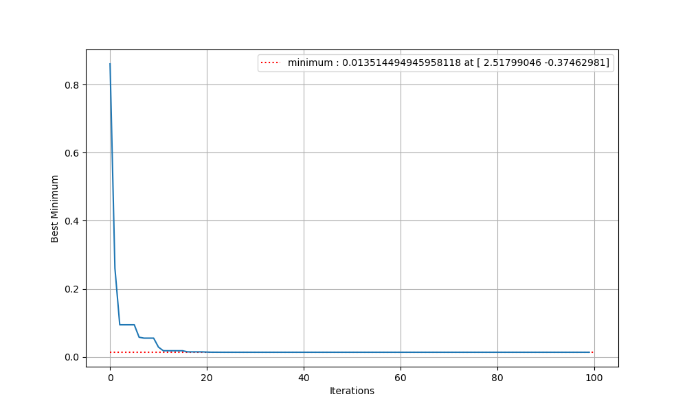
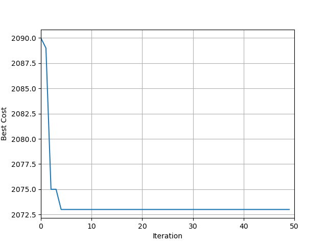

# Artificial_Intelligence
This repo presents different tasks related to AI. These tasks include searching algorithms (BFS,DFS and Ant Colony Optimization) to solve the Travelling Salesman Problem, A Particle Swarm Optimization algorithm to minimize the selected function. In addition, the job scheduling problem is solved using Genetic Algorithm (GA).

## BFS,DFS,ACO
See the files BFS,DFS and ACO for the codes to solve the problem based on the instructions below:-

1. Create a set of cities (as points) with coordinates x, y on a plane with height as z coordinate. The cost of going from city A to city B is equal to the Euclidean distance between two cities, if there exists a road. You should define scenarios according to two criteria:  

    a) There are all the direct connections / c.a. 80% of possible connections 

    b) The problem is symmetrical / asymmetrical (in asymmetrical – going up is height +10%, going down: -10%) 

2. You should choose the coordinates randomly from the range <-100, 100> for x,y and <0, 50> for z. 

3. Represent the created map as a weighted (directed) graph, where cities are the nodes and roads are the edges of the graph. 
In the created scene, solve the traveling salesman problem: The salesman starts from a chosen city and has to visit every city exactly once before returning to the starting city. The goal is to find a path with the lowest cost. 

## The Particle Swarm Optimization (PSO)
Implement the Particle Swarm Optimisation algorithm to find the minimum of the following function:

f(x,y) = (1.5 – x -xy)^2 + (2.25 – x + xy^2)^2 + (2.625 – x + xy^3)^2 for x,y in range <-4.5, 4.5>

see the optimal solution found, plot in plots folder.

## Genetic algorithm
Here the job scheduling problem is solved using Genetic algorithm, one of the evolutionary algorithm which mimics human evolution.Genetic algorithm is implemented to schedule jobs using available resources, so that the time to finish all tasks is minimal. The algorithm can be tuned with different parameters to obtain desirable results. The data is in a separate excel file in the data folder – each task has the resource (R) and time needed using this resource (T) in a specific order. You cannot change the order of operations within the task. Below, is a resultant plot after optimization, this is not final as more optimizations can be performed to yield the more robust schedule.

